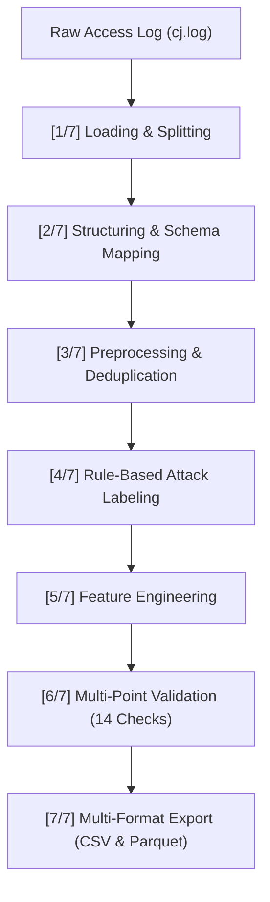

# Practical 10: Reusable Data Pipeline for Log Files

## Project Title
**"Reusable Data Pipeline for Log Files"**

## Laboratory Course
**Python for Data Science (PDS) — Cybersecurity Analytics Practicals**

---

## 1. Purpose & Scope
The objective of Practical 10 is to build an automated, modular, reusable, and auditable end-to-end Python data processing pipeline for web honeypot/access log telemetry.

The pipeline integrates the core logic developed across **Practicals 1–5** into a single cohesive, production-ready class `LogProcessingPipeline`:
1. **Loading** raw logs (`cj.log` or custom input) safely with UTF-8 decoding.
2. **Parsing & Structuring** unstructured JSON arrays into schema-aligned dataframes with 13 standard columns.
3. **Preprocessing & Cleaning** via timestamp conversion, exact row deduplication, field-specific missing value imputation, and path normalization (`normalized_resource`).
4. **Rule-Based Attack Labeling** into multi-class categories (`sqli`, `path_traversal`, `command_injection`, `xss`, `brute_force`, `benign`) with strict priority resolution and human-readable reasoning (`label_reason`).
5. **Feature Engineering** producing 18+ deterministic numeric behavioral, lexical, rate, and structural features without target leakage.
6. **Multi-Point Validation** enforcing 14 data quality and pipeline integrity criteria.
7. **Multi-Format Serialization** exporting clean intermediate and final datasets into both CSV and Apache Parquet formats.

**Guarantees & Constraints:**
- No ML classifiers are trained in Practical 10.
- No synthetic balancing (SMOTE / oversampling / undersampling) is applied.
- The original raw dataset (`cj.log`) is never modified or overwritten.
- All statistics, metrics, and distributions reflect true empirical dataset values.
- Built exclusively with free and open-source Python libraries.

---

## 2. Directory Structure

```text
Practical 10\
│
├── pipeline\
│   ├── __init__.py               # Package initializer
│   ├── config.py                 # Central configurations, default paths, attack regexes
│   ├── log_pipeline.py           # Core LogProcessingPipeline class (Stages 1-7)
│   └── run_pipeline.py           # CLI runner supporting --input, --output, --format
│
├── data\
│   ├── raw\                      # Storage for optional custom raw log inputs
│   └── processed\
│       ├── structured_logs.csv             # Stage 2: 13-column parsed logs
│       ├── labeled_logs.csv                # Stage 4: Rule-labeled logs with label_reason
│       ├── feature_engineered_logs.csv     # Stage 5: Final feature matrix (CSV)
│       └── feature_engineered_logs.parquet # Stage 5: Final feature matrix (Parquet)
│
├── reports\
│   └── pipeline_report.txt       # Stage 7: Comprehensive execution audit report
│
├── outputs\
│   └── pipeline_summary.json     # Stage 7: Machine-readable JSON summary
│
├── run_pipeline.py               # Top-level runner wrapper
├── requirements.txt              # Pipeline Python dependencies
└── README.md                     # Pipeline documentation
```

---

## 3. Pipeline Stages & Methodology

The pipeline executes seven sequential stages with stage timing and progress reporting:



### Stage 1: Loading (`load`) `[1/7]`
- Safely streams lines from `cj.log` using UTF-8 encoding with replacement characters for non-decodable bytes.
- Resolves concatenated JSON arrays caused by concurrent buffer flushes (`][`).

### Stage 2: Structuring (`structure`) `[2/7]`
- Ingests JSON arrays into the canonical 13-column schema:
  - **8 Source Fields**: `category_type`, `payload`, `timestamp`, `client_ip`, `client_port`, `user_agent`, `accept_language`, `proxy_ip`.
  - **5 Standard HTTP Fields**: `request_type`, `status_code`, `resource_requested`, `bytes_sent`, `referrer` (preserved as `None`).
- Exports `data/processed/structured_logs.csv`.

### Stage 3: Preprocessing (`preprocess`) `[3/7]`
- Converts `timestamp` to `datetime64[ns]` with `errors="coerce"`.
- Eliminates exact duplicate records across all columns while preserving distinct temporal events from identical IPs.
- Imputes missing values with domain strategies (`'unknown'` for text, `'none'` for empty headers, `0` for numeric ports/sizes).
- Normalizes URL paths into `normalized_resource` (e.g., `/index.html` -> `/index`).

### Stage 4: Rule-Based Attack Labeling (`label`) `[4/7]`
- Evaluates attack signatures against `payload`, `normalized_resource`, and `category_type` using strict deterministic priority:
  1. `sqli` (SQL Injection: UNION SELECT, tautologies, comments)
  2. `path_traversal` (Directory climbing `../`, sensitive files)
  3. `command_injection` (Shell separators `;`, `|`, system binaries)
  4. `xss` (`<script>`, event handlers, cookie theft)
  5. `brute_force` (Rolling window: >=10 authentication attempts in 10 minutes per IP)
  6. `benign` (Normal traffic)
- Populates `label` and explanatory `label_reason`.
- Exports `data/processed/labeled_logs.csv`.

### Stage 5: Feature Engineering (`engineer_features`) `[5/7]`
- Extracts 18+ deterministic numeric features using vectorized Pandas/NumPy operations and unique-string dictionary caching for O(unique) speed:
  - `requests_per_ip`, `ip_request_rank`
  - `requests_per_ip_1min`, `requests_per_ip_5min` (computed via vectorized `np.searchsorted`)
  - `inter_request_time`
  - `status_code_frequency`
  - `url_length`, `url_entropy`, `path_depth`, `query_parameter_count`, `special_character_count`, `digit_ratio`, `letter_ratio`
  - `payload_length`, `payload_entropy`, `contains_sql_keyword`, `contains_path_traversal`, `contains_script_tag`, `contains_command_separator`
  - `failed_pattern_count`
  - `unique_urls_per_ip`
  - `is_bot`, `is_scanner`, `user_agent_length`
  - `request_rate_1min`, `request_rate_5min`
- Strictly isolates `label` and `label_reason` to guarantee zero target leakage into downstream ML applications.

### Stage 6: Validation (`validate`) `[6/7]`
- Runs 14 automated data-integrity and pipeline health checks.

### Stage 7: Saving & Reporting (`save`) `[7/7]`
- Serializes final dataset to `feature_engineered_logs.csv` and `feature_engineered_logs.parquet`.
- Generates `reports/pipeline_report.txt` and `outputs/pipeline_summary.json`.

---

## 4. Installation & Environment

Use Python 3.13:
```powershell
& "C:\Users\ASUS\AppData\Local\Programs\Python\Python313\python.exe" -m pip install -r requirements.txt
```

---

## 5. Usage & Command-Line Arguments

Display help and available options:
```powershell
python run_pipeline.py --help
```

Output:
```text
options:
  -h, --help            show this help message and exit
  -i, --input INPUT_PATH
                        Path to the input raw log file (supports .log, .json, .txt). (default: D:\Pds Practicals\Practical 1\data\raw\cj.log)
  -o, --output OUTPUT_DIR
                        Directory to save the processed output datasets and artifacts. (default: D:\Pds Practicals\Practical 10\data\processed)
  -f, --format {csv,parquet,all}
                        Desired serialization format for final feature-engineered dataset. (default: all)
```

Run with default input dataset (`cj.log`):
```powershell
python run_pipeline.py
```

Run with a custom input path:
```powershell
python run_pipeline.py --input "path\to\custom_log.log" --format parquet
```

Programmatic Python usage:
```python
from pipeline.log_pipeline import LogProcessingPipeline

pipeline = LogProcessingPipeline(input_path="data/raw/cj.log")
results = pipeline.run()
```

---

## 6. Validation Suite (14 Checks)

| Check | Description |
| :--- | :--- |
| `[PASS] Input file exists` | Verifies existence of the source log file on disk |
| `[PASS] Logs loaded` | Verifies raw records were successfully streamed |
| `[PASS] Data structured` | Verifies DataFrame contains 13 standard columns |
| `[PASS] Timestamp processed` | Verifies timestamp converted to `datetime64[ns]` with 0 NaTs |
| `[PASS] Missing values handled` | Verifies 0 residual NaNs in cleaned feature matrix |
| `[PASS] Exact duplicates handled` | Verifies exact row deduplication logic executed |
| `[PASS] Labels generated` | Verifies `label` and `label_reason` columns are populated |
| `[PASS] Expected label classes checked` | Verifies all 6 attack/benign categories are evaluated |
| `[PASS] Features generated` | Verifies >= 18 numeric engineered features created |
| `[PASS] No label leakage into ML features` | Verifies `label` and `label_reason` excluded from features |
| `[PASS] Output CSV exists` | Verifies `feature_engineered_logs.csv` exists and non-empty |
| `[PASS] Output Parquet exists` | Verifies `feature_engineered_logs.parquet` exists and non-empty |
| `[PASS] Output row count valid` | Verifies final records match deduplicated preprocessed count |
| `[PASS] Pipeline completed` | Verifies all stages executed cleanly to completion |

---

## 7. Operational Limitations
1. **Honeypot Schema Invariance**: Raw honeypot logs capture network connections and payloads, but do not contain Apache/Nginx status codes or byte transfer counts. These fields are preserved as standard neutral defaults (`0` or `'none'`).
2. **Concept Drift**: Attack signatures rely on known SQLi, XSS, and traversal patterns. Polymorphic or novel zero-day payloads require periodic regex pattern updates in `config.py`.
3. **Memory Footprint**: While streaming parsing and unique-dictionary caching minimize RAM overhead, processing multi-gigabyte log batches is best scaled using chunked partitioning or distributed engines (PySpark/Dask).
